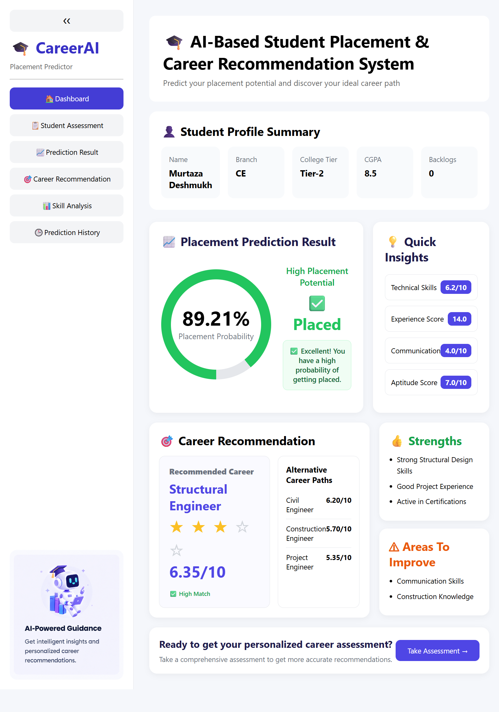
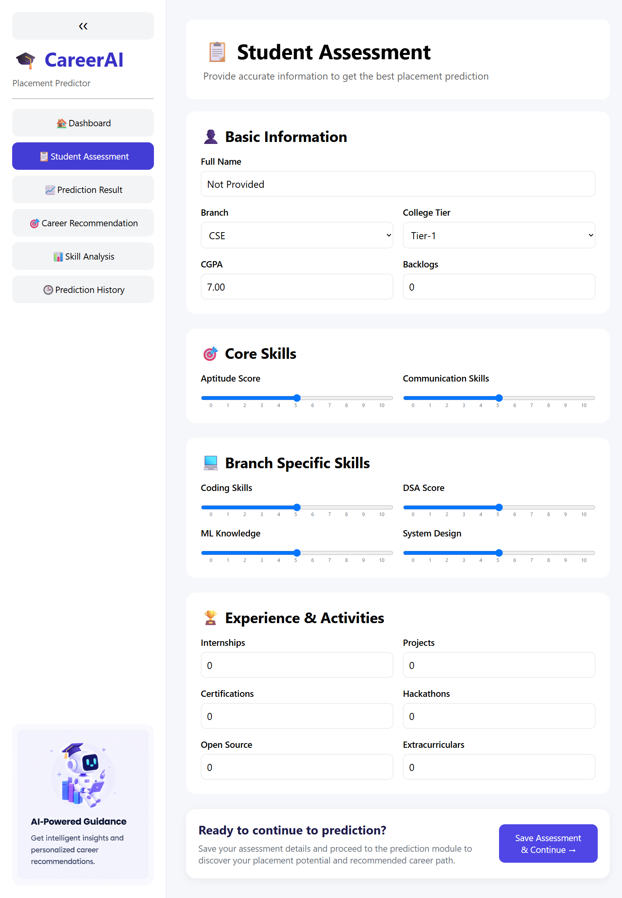
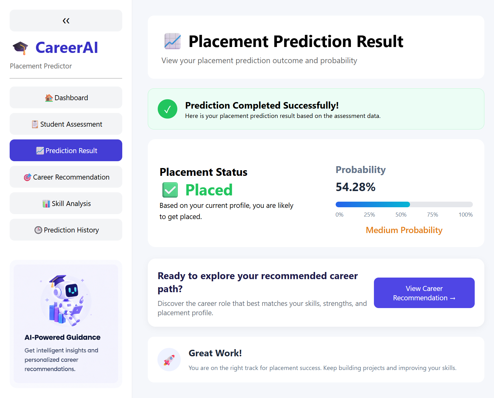
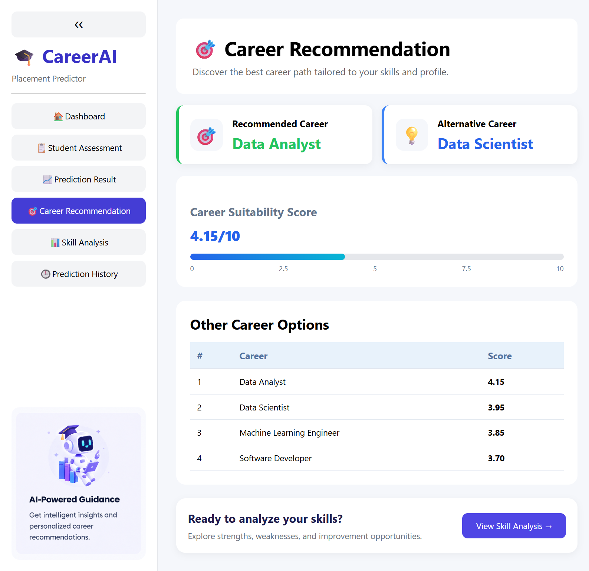
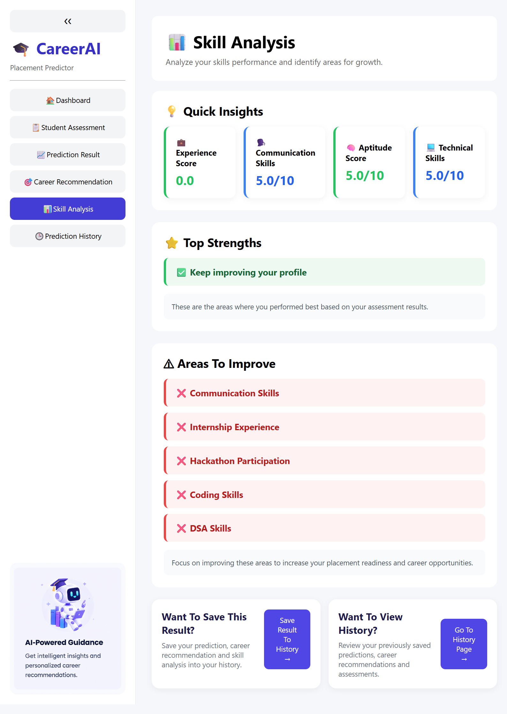
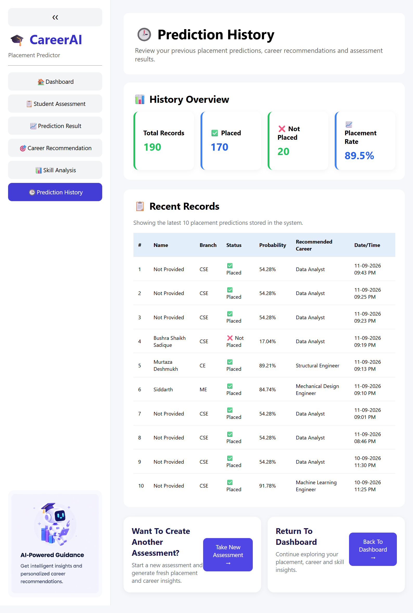

&nbsp;&nbsp;&nbsp;&nbsp;&nbsp;
&nbsp;&nbsp;&nbsp;&nbsp;&nbsp;
&nbsp;&nbsp;&nbsp;&nbsp;&nbsp;
&nbsp;&nbsp;&nbsp;&nbsp;&nbsp;

# 🎓 AI-Based Student Placement Prediction and Career Recommendation System

## 📌 Project Overview

The AI-Based Student Placement Prediction and Career Recommendation System is a Machine Learning project developed to predict a student's placement chances and recommend suitable career paths based on academic performance, technical skills, practical experience, and extracurricular activities.

The system combines placement prediction with a branch-aware career recommendation engine, enabling students from different engineering disciplines to receive personalized career guidance. The project also includes cloud database integration and a responsive web application for real-time predictions and recommendations.

## 🌐 Live Application

🔗 Live Website: [🚀 Visit↗](https://student-placement-career-recommendation.onrender.com/)

## 🎯 Objectives

* Predict whether a student is likely to be placed.
* Calculate placement probability using Machine Learning.
* Recommend suitable career paths based on student profiles.
* Support multiple engineering branches through branch-specific recommendations.
* Store prediction results and student information in a cloud database.
* Provide an interactive and responsive web application.

## 🛠️ Technology Stack

### Programming Language
* Python

### Machine Learning
* Pandas
* NumPy
* Scikit-Learn
* Joblib

### Backend
* Flask

### Frontend
* HTML
* CSS
* JavaScript

### Database
* MySQL
* Aiven Cloud Database

### Deployment
* Render

### Development Environment
* Jupyter Notebook
* Visual Studio Code
* GitHub

## 📊 Dataset Description

The project uses a student placement dataset containing academic, technical, and extracurricular information.

### Academic Information
* Branch
* College Tier
* CGPA
* Backlogs

### Technical Skills
* Coding Skills
* DSA Score
* Aptitude Score
* Communication Skills
* Machine Learning Knowledge
* System Design Knowledge

### Experience and Activities
* Internships
* Projects
* Certifications
* Hackathons
* Open Source Contributions
* Extracurricular Activities

### Target Variable
* Placement Status
* Recommended Career

## ⚙️ Feature Engineering

To improve prediction performance, additional features were created from the original dataset.

### Engineered Features
* Technical Skill Score
* Experience Score
* Has Backlog
* Technical Skill Gap
These engineered features help the model better understand a student's overall skill level, experience profile, and placement readiness.

## 🤖 Machine Learning Models

### Models Evaluated
* Logistic Regression
* Decision Tree Classifier
* Random Forest Classifier
* Gradient Boosting Classifier
After evaluation and comparison, the best-performing model was selected for deployment in the final application.

## 🎯 Placement Prediction System

The placement prediction module analyzes student information and predicts placement outcomes.

### System Outputs
* Placement Status
* Placement Probability
The prediction is generated using the trained Machine Learning model after applying preprocessing and feature engineering techniques.

## 🚀 Branch-Aware Career Recommendation System

The project includes a custom branch-aware recommendation engine that suggests career paths according to the student's engineering discipline and skill profile.

### Supported Branches
* Computer Science Engineering (CSE)
* Information Technology (IT)
* Electronics and Communication Engineering (ECE)
* Electrical Engineering (EE)
* Mechanical Engineering (ME)
* Civil Engineering (CE)
* Chemical Engineering

### Career Recommendation Factors
* Technical Skills
* Academic Performance
* Internships
* Projects
* Certifications
* Communication Skills
* Branch-Specific Knowledge

### Recommendation Output
* Recommended Career
* Career Suitability Score
* Alternative Career Option

## 🗄️ Cloud Database Integration

The application uses MySQL hosted on Aiven Cloud Database to store prediction history and student information.

### Stored Information
* Student Details
* Placement Status
* Placement Probability
* Recommended Career
* Career Suitability Score
* Alternative Career Recommendation
* Branch-Specific Skill Information
* Prediction Timestamp
The cloud database allows records to be securely stored and accessed from anywhere.

## 🌐 Flask Web Application

A Flask-based web application was developed to provide a responsive and interactive user experience.

### Application Features
* Student Assessment Form
* Placement Prediction
* Career Recommendation
* Skill Gap Analysis
* Prediction History
* Cloud Database Storage
* Mobile Responsive Design
* Tablet Responsive Design
The application enables real-time prediction and recommendation generation through an intuitive interface.

## ☁️ Deployment

The complete application is deployed using Render and connected to an Aiven Cloud MySQL Database.

### Deployment Architecture
User → Flask Application (Render) → Machine Learning Model → Aiven Cloud Database

## ✅ Testing and Validation

### Testing Areas
* Dataset Validation
* Feature Engineering Validation
* Preprocessing Validation
* Model Validation
* Placement Prediction Testing
* Career Recommendation Testing
* Database Testing
* Flask Application Testing
* Responsive Design Testing
* Branch-Wise Recommendation Testing

### Validation Results
All modules were tested successfully, and the outputs matched the expected results across all supported engineering branches.

## 📈 Results

### Key Achievements
* Accurate placement prediction using Machine Learning.
* Branch-aware career recommendation system.
* Cloud database integration using Aiven.
* Deployment on Render.
* Responsive Flask web application.
* Complete testing and validation.
* Support for multiple engineering disciplines.

## 🔮 Future Scope

* Resume Analysis
* Skill Gap Analysis Enhancement
* Learning Path Recommendations
* Interview Preparation Assistance
* Company-Specific Placement Prediction
* Admin Dashboard
* User Authentication System
* AI Career Assistant Chatbot

## 📸 Project Screenshots

### 🏠 Home Dashboard

### 📋 Assessment Form

### 📈 Placement Prediction

### 🎯 Career Recommendation

### 📊 Skill Gap Analysis

### 🕒 Prediction History

## 📄 License

This project is intended for educational and academic purposes.

## 👨‍💻 Author

**Bushra Shaikh**
B.Tech Computer Science (Data Science)
AI-Based Student Placement Prediction and Career Recommendation System
